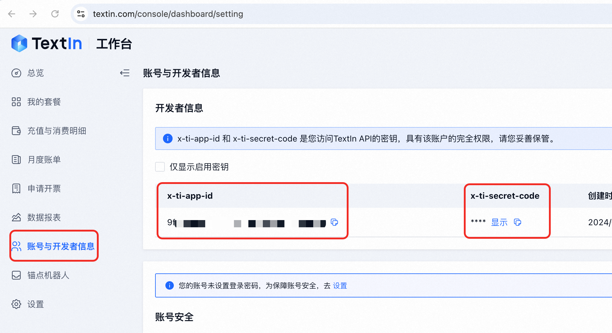

# LetsRead

## 项目简介

本项目是基于 [intsig-textin/parsex-frontend](https://github.com/intsig-textin/parsex-frontend) 的二次开发版本。我们对原始项目进行了定制和扩展，以满足特定的需求。本项目遵循 CC-NC License，仅供非商业性使用。

## 特性

以下是我们项目实现的一些主要特性：

1. **预览渲染主流图片格式和 pdf 文件**，提供缩放和旋转功能。
3. **笔记**，随PDF记录笔记。
3. **翻译**，支持英文翻译。
3. **对话**，使用Moonshot API，支持对话。
2. **密钥管理**，支持个人输入第三方服务密钥。

## 安装依赖

请确保你的开发环境满足以下要求：

1. node 版本 >= 18.20.4
2. 强烈建议使用 `yarn` 包管理器。

拉取项目：

```bash
git clone https://github.com/PiuQiuPiaQia/letsread-fe
```

使用 npm 或 yarn 安装依赖：

```bash
yarn install
```

## 启动项目

```bash
yarn start
# 或
npm run start
```

项目将在浏览器中启动.

## QA

### 自定义密钥

修改页面【首页 => 设置 => 密钥】

### 如何获取 `x-ti-app-id`, `x-ti-secret-code`
请在 [Textin官网](https://www.textin.com/console/dashboard/setting) 免费注册或登录账号后查看。


## 贡献

我们欢迎任何形式的贡献！

## 许可证

本项目基于 [CC-NC License](https://creativecommons.org/licenses/by-nc/4.0/) 进行许可。原始项目 [intsig-textin/parsex-frontend](https://github.com/intsig-textin/parsex-frontend) 同样基于此许可证。